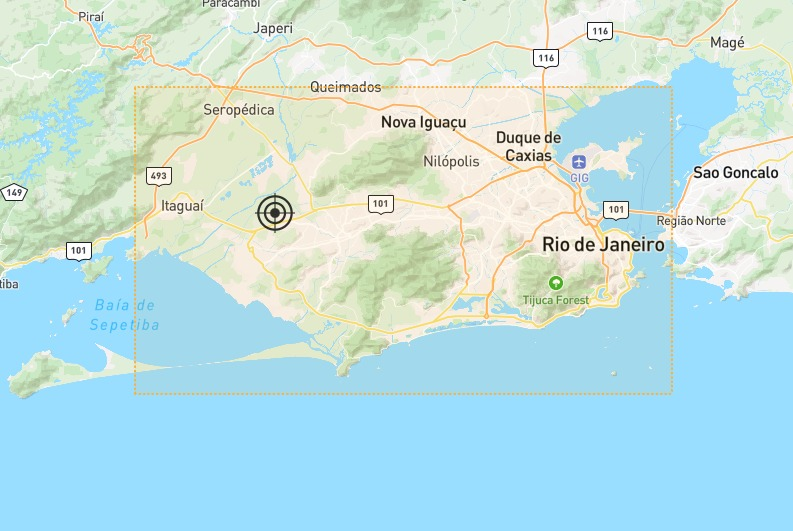

# Desafio Civitas
--------------------------------------------------------------------

### Setup
Primeiro, vamos contar o número de placas presentes no dataset:

```sql
select count(distinct placa) from rj-cetrio.desafio.readings_2024_06
```
Executando essa query, vemos que há um total de 7984610 (aproximadamente 8 milhões) de placas no banco de dados. 

Agora, vamos delimitar a cidade do Rio de Janeiro no mapa usando um retângulo. Isso será útil para vermos se há posições medidas que estão fora da cidade do Rio.



As coordenadas que limitam o retângulo são: latitude entre -23.09617 e -22.71584, longitude entre -43.83891 e -43.11669. Linhas com coordenadas fora deste retângulo serão descartadas da nossa análise, pois estas seriam erros de medida.

```sql
select count(1) from rj-cetrio.desafio.readings_2024_06
where not (camera_latitude between -23.09617 and -22.71584)
or not (camera_longitude between -43.83891 and -43.11669)
```

Já descartamos, assim, 566817 linhas da tabela. Vamos utilizar a query anterior para verificar quantas linhas têm datahora irregular, removidas as medidas com posições incorretas. Como as medidas devem ser de junho/2024, desconsideraremos as linhas com datahora fora desse mês.

```sql
select count(1) from rj-cetrio.desafio.readings_2024_06
where (not (camera_latitude between -23.09617 and -22.71584)
or not (camera_longitude between -43.83891 and -43.11669))
and not (datahora between '2024-06-01 00:00:00' and '2024-06-30 23:59:59')
```
A última query não retornou nenhum resultado, o que mostra que os dados estão limpos para o campo datahora.


### A query para detecção de placas duplicadas

Sem delongas, abaixo está a query para detectar placas clonadas:

```sql
with placas_seq as (
  select placa,
         datahora, 
         rank() over (partition by placa order by datahora) as seq,
         camera_latitude,
         camera_longitude
  from rj-cetrio.desafio.readings_2024_06
  where camera_latitude between -23.09617 and -22.71584
  and camera_longitude between -43.83891 and -43.11669
  and datahora_captura between '2024-06-01 00:00:00' and '2024-06-30 23:59:59'
),
params as (
  select 
       o.placa as placa
    ,  st_geogpoint(o.camera_longitude, o.camera_latitude) as ponto_inicial
    ,  st_geogpoint(t.camera_longitude, t.camera_latitude) as ponto_final
    ,  o.datahora as t_inicial
    ,  t.datahora as t_final
    ,  st_distance(st_geogpoint(o.camera_longitude, o.camera_latitude), st_geogpoint(t.camera_longitude, t.camera_latitude), true) as delta_s
    ,  timestamp_diff(t.datahora, o.datahora, second) as delta_t
    ,  st_distance(st_geogpoint(o.camera_longitude, o.camera_latitude), st_geogpoint(t.camera_longitude, t.camera_latitude), true)/timestamp_diff(t.datahora, o.datahora, second) as velocidade_media
from placas_seq o join placas_seq t 
on o.placa = t.placa and o.seq + 1 = t.seq
)
select *
from params
where 
velocidade_media > 42
```

Vamos explicar parte por parte, a começar pelas CTEs:
```sql
placas_seq as (
  select placa,
         datahora, 
         rank() over (partition by placa order by datahora) as seq,
         camera_latitude,
         camera_longitude
  from rj-cetrio.desafio.readings_2024_06
  where camera_latitude between -23.09617 and -22.71584
  and camera_longitude between -43.83891 and -43.11669
  and datahora_captura between '2024-06-01 00:00:00' and '2024-06-30 23:59:59'
)
```
A primeira CTE cria uma tabela com os únicos campos que utilizaremos na detecção de placas clonadas. É uma CTE que ordena cada placa no tempo, rotulando cada medida com um número indicando a ordem em que os veículos passaram por cada posição.
```sql
params as (
  select 
       o.placa as placa
    ,  st_geogpoint(o.camera_longitude, o.camera_latitude) as ponto_inicial
    ,  st_geogpoint(t.camera_longitude, t.camera_latitude) as ponto_final
    ,  o.datahora as t_inicial
    ,  t.datahora as t_final
    ,  st_distance(st_geogpoint(o.camera_longitude, o.camera_latitude), st_geogpoint(t.camera_longitude, t.camera_latitude), true) as delta_s
    ,  timestamp_diff(t.datahora, o.datahora, second) as delta_t
    ,  st_distance(st_geogpoint(o.camera_longitude, o.camera_latitude), st_geogpoint(t.camera_longitude, t.camera_latitude), true)/timestamp_diff(t.datahora, o.datahora, second) as velocidade_media
from placas_seq o join placas_seq t 
on o.placa = t.placa and o.seq + 1 = t.seq
)
```
A segunda CTE junta medidas, para cada placa, consecutivas, formando um conjunto de dados de trechos, com a velocidade média para ir do trecho considerado ao próximo. Essa velocidade média será o parâmetro utilizado para detectar placas clonadas, uma vez que é fisicamente impossível para um veículo alcançar certas velocidades - ainda mais em território urbano.

A última parte do código é onde podemos fazer nossas análises, a partir das duas tabelas anteriores. 

Para finalizar esta cessão, vamos calcular o número de placas clonadas trocando a parte final da query (fora das CTEs) por

```sql
select count(distinct placa)
from params
where 
velocidade_media > 42
```

Assim, vemos uma quantidade de 94886 placas possivelmente clonadas, o que representa aproximadamente 0,01% do total.


### Análise de Tipo de Veículo

Vamos analisar o dataset em termos de tipo de veículo. Primeiro, contemos quantos temos para cada tipo.

```sql
select tipoveiculo, count(distinct placa) 
from rj-cetrio.desafio.readings_2024_06
group by tipoveiculo
```
|Tipo Veículo| Quantidade|
|------------|-----------|
|automovel|7794260|
|ciclomotor|507514|
|caminhao|89635|
|onibus|105457|

Em porcentagens:

|Tipo Veículo| Quantidade|
|------------|-----------|
|automovel|97,6%|
|ciclomotor|6,3%|
|caminhao|1,1%|
|onibus|1,3%|

A soma de ciclomotores com automóveis excede 100%, o que indica que existem placas que estão sendo utilizadas tanto para motos quanto para carros. Vamos encontrar estas:
```sql
select distinct placa from rj-cetrio.desafio.readings_2024_06 
where tipoveiculo = 'ciclomotor'
intersect distinct
select distinct placa from rj-cetrio.desafio.readings_2024_06 
where tipoveiculo = 'automovel'
```

Vamos contar quantas estas são:
```sql
with inter as (select distinct placa from rj-cetrio.desafio.readings_2024_06 
where tipoveiculo = 'ciclomotor'
intersect distinct
select distinct placa from rj-cetrio.desafio.readings_2024_06 
where tipoveiculo = 'automovel')
select count(1) from inter
```

Para um total de 343422. Isso seria um indício de mais placas clonadas? Ou um erro na captura de dados? É um número bem mais elevado do que o calculado anteriormente.


### Conclusão

Ou o Rio tem muitas placas clonadas, ou há um sério problema com os dados dessa tabela.